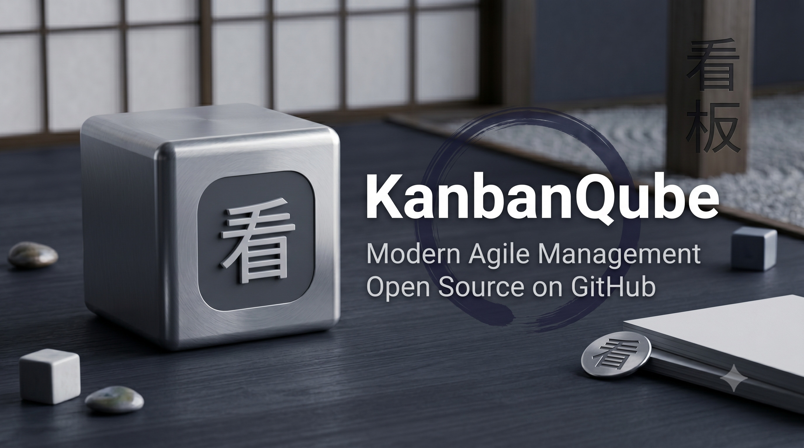
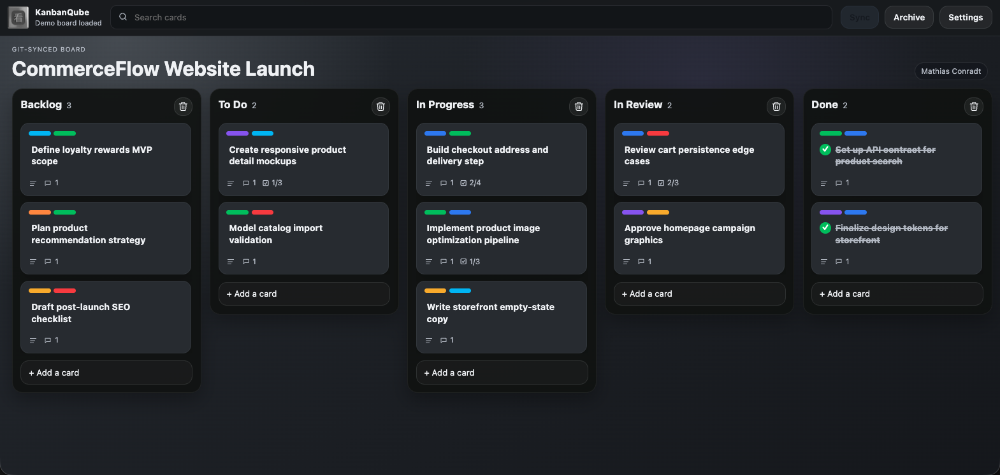

# KanbanQube

[](https://sonarcloud.io/summary/new_code?id=mathiasconradt_kanbanqube)
[](LICENSE)
[](https://ko-fi.com/mathiasconradt)




KanbanQube is a local-first Kanban board app for solo users and very small teams. A board lives as normal files in a regular vault folder on your machine and can optionally be placed inside a Git repository, so changes can be versioned and synced with tools you already use.

The app provides lanes, cards, labels, checklists, comments, due dates, assignees, card covers, file attachments, archived cards, search, keyboard navigation, and a card-detail view. Uploaded files are stored in an `uploads/` folder, while board data is split into per-object JSON files under `board/` so Git can merge independent card and checklist edits more cleanly.



## Table Of Contents

- [Requirements](#requirements)
- [Run With npx](#run-with-npx)
- [Install](#install)
- [Homebrew](#homebrew)
- [Run On macOS Login](#run-on-macos-login)
- [Vaults](#vaults)
- [Board Workflow](#board-workflow)
- [Git Sync](#git-sync)
- [Trello Import](#trello-import)
- [Demo Board](#demo-board)
- [Identity](#identity)
- [Assignees And Due Dates](#assignees-and-due-dates)
- [Attachments And Covers](#attachments-and-covers)
- [Keyboard Shortcuts](#keyboard-shortcuts)
- [Development](#development)
- [Build](#build)
- [Release Automation](#release-automation)
- [Star History](#star-history)

## Requirements

- Node.js 18 or newer
- Git, if you want repository sync
- A folder to use as your board vault

## Run With npx

Run KanbanQube against a vault folder:

```sh
npx kanbanqube /path/to/your/vault
```

Then open:

```text
http://localhost:3888
```

If no path is provided, KanbanQube uses the current working directory as the vault:

```sh
npx kanbanqube
```

You can choose a different port:

```sh
PORT=4000 npx kanbanqube /path/to/your/vault
```

## Install

Global install:

```sh
npm install -g kanbanqube
kanbanqube /path/to/your/vault
```

Local development install from this repository:

```sh
npm install
npm start -- /path/to/your/vault
```

## Homebrew

Install from the project tap:

```sh
brew tap mathiasconradt/kanbanqube https://github.com/mathiasconradt/kanbanqube
brew install kanbanqube
kanbanqube /path/to/your/vault
```

KanbanQube currently installs as a Homebrew formula for the Node.js command-line server, not as a macOS app cask. If a future app cask or manual macOS app zip is added, the cask should remove the macOS quarantine attribute during install. If you download an app release zip manually and macOS says the app is damaged, run:

```sh
xattr -cr "/Applications/KanbanQube.app"
```

## Run On macOS Login

Use a macOS LaunchAgent if you want KanbanQube to start automatically in the background when you log in.

First check where `npx` is installed:

```sh
command -v npx
```

Create `~/Library/LaunchAgents/com.mathiasconradt.kanbanqube.plist` and adjust the vault path if needed:

```xml
<?xml version="1.0" encoding="UTF-8"?>
<!DOCTYPE plist PUBLIC "-//Apple//DTD PLIST 1.0//EN"
  "http://www.apple.com/DTDs/PropertyList-1.0.dtd">
<plist version="1.0">
  <dict>
    <key>Label</key>
    <string>com.mathiasconradt.kanbanqube</string>

    <key>ProgramArguments</key>
    <array>
      <string>/opt/homebrew/bin/npx</string>
      <string>kanbanqube</string>
      <string>/Users/mathias.conradt/Documents/kanbanqube_vault</string>
    </array>

    <key>EnvironmentVariables</key>
    <dict>
      <key>PATH</key>
      <string>/opt/homebrew/bin:/usr/local/bin:/usr/bin:/bin:/usr/sbin:/sbin</string>
      <key>PORT</key>
      <string>3888</string>
    </dict>

    <key>WorkingDirectory</key>
    <string>/Users/mathias.conradt</string>

    <key>RunAtLoad</key>
    <true/>

    <key>KeepAlive</key>
    <true/>

    <key>StandardOutPath</key>
    <string>/tmp/kanbanqube.out.log</string>

    <key>StandardErrorPath</key>
    <string>/tmp/kanbanqube.err.log</string>
  </dict>
</plist>
```

Load and start it:

```sh
launchctl bootstrap gui/$(id -u) ~/Library/LaunchAgents/com.mathiasconradt.kanbanqube.plist
launchctl kickstart -k gui/$(id -u)/com.mathiasconradt.kanbanqube
```

Check status and logs:

```sh
launchctl print gui/$(id -u)/com.mathiasconradt.kanbanqube
tail -f /tmp/kanbanqube.out.log
tail -f /tmp/kanbanqube.err.log
```

Stop and unload it:

```sh
launchctl bootout gui/$(id -u)/com.mathiasconradt.kanbanqube
```

The example runs KanbanQube on `http://localhost:3888`. If that port is already used, change the `PORT` value in the plist.

## Vaults

A vault is just a directory. KanbanQube stores:

```text
vault/
  board/
    meta.json
    cards/
    lists/
    checklists/
    actions/
    labels/
    members/
  uploads/
```

If `board/` does not exist, KanbanQube creates it automatically. If `uploads/` does not exist, it is created when the first file is uploaded.

Uploaded filenames are made unique while preserving the original name in the UI. For example:

```text
MyExample.png
MyExample.kbq_20260609T092141981Zb7a252.png
```

The stored filename prevents conflicts. The app still displays `MyExample.png`.

## Board Workflow

Use the board view for quick work:

- Click `+ Add a card` to create a card directly in the lane and type its title inline.
- Click the board title or lane title to rename it inline.
- Click a card to open its details.
- Settings can enable inline editing for existing card titles in board lanes.
- Set due dates and assignees in card details. Cards show due dates and assigned user avatars directly in the board view.

## Git Sync

Git sync is optional. If the vault is a Git repository with a configured `origin` remote, the Sync button is enabled.

When Sync runs, KanbanQube:

1. Saves pending board changes.
2. Checks whether anything in the vault repository changed.
3. Stages and commits all repository changes when needed, including `board/`, `uploads/`, and newly added files.
4. Runs `git pull --rebase` to bring in remote changes after local work is committed.
5. Pushes to the configured remote.
6. Reloads the board from disk so changes pulled from another machine are visible without refreshing the browser.

If the vault is not a Git repository, or no remote is configured, Sync stays disabled. You can still use the board locally.

Settings includes `Run Git sync in the background (no dialog)`. When enabled, the Sync button runs without opening the sync log automatically. The status text under the app title can still be clicked to open the sync log during or after sync.

Recommended setup:

```sh
mkdir my-kanban-vault
cd my-kanban-vault
git init
git remote add origin git@github.com:you/my-kanban-vault.git
npx kanbanqube .
```

Commit and push once if your remote requires an initial branch:

```sh
git add board
git commit -m "Initialize KanbanQube board"
git push -u origin main
```

## Trello Import

KanbanQube can import a Trello board export JSON from Settings. Import is only enabled when the current board has no cards. This keeps accidental replacement of an active board from happening inside the app.

Imported data is normalized and written into the split `board/` vault layout.

## Demo Board

The repository includes `demo_board.json`, a sample e-commerce product board with design, UX, frontend, backend, QA, content, and analytics work spread across the default lanes.

When a vault has no cards, KanbanQube asks whether to load the demo board. If accepted, the app loads `demo_board.json` and saves it into the current vault using the same path as a normal import.

## Identity

KanbanQube reads your Git identity from the vault repository first:

```sh
git config --local user.name
git config --local user.email
```

If local values are missing, it falls back to global Git config:

```sh
git config --global user.name
git config --global user.email
```

That name is used for comments and activity entries. The settings dialog shows the detected name and email as read-only values.

KanbanQube also reads commit authors from the vault Git repository and makes them available as assignable users. Git can usually provide the author name and email address from existing commits. If the vault has no Git history, KanbanQube still includes your own detected Git identity.

User avatars are loaded from Gravatar based on email address. If no Gravatar image exists, the app falls back to initials.

## Assignees And Due Dates

Open a card to assign users and set a due date. Assigned users are shown as small avatars on the card in board view, with their name available on hover.

Due dates are stored on the card and shown below the card title in board view. Completed cards keep the due date visible in a completed state, while overdue open cards are highlighted.

## Attachments And Covers

Drop files onto a card or into the card details view to attach them. Files are uploaded into the vault `uploads/` folder.

Images can be used as card covers. The cover is stored as a pointer to the attachment in `card.cover.idAttachment`, so removing a cover does not delete the attachment. You can also select another image attachment as the cover.

Deleting an uploaded attachment from a card also deletes the physical file from `uploads/` when no other card still references that file.

## Keyboard Shortcuts

Board view shortcuts are ignored while typing in inputs or while a dialog is open.

| Key | Action |
| --- | --- |
| Arrow keys | Select cards across lanes and rows |
| Enter | Open selected card details |
| Space | Toggle selected card done status |
| c | Archive selected card |
| 1-9 | Toggle the matching label by label-list order |

## Development

Start the app from the repository:

```sh
npm start -- /path/to/your/vault
```

Run checks:

```sh
npm test
```

Main files:

- `server.js` - HTTP server, vault storage, upload handling, Git sync
- `public/app.js` - board UI behavior
- `public/styles.css` - app styling
- `public/index.html` - static app shell

## Build

KanbanQube has no frontend build step. The app is plain Node.js plus static browser assets.

Validate the server and browser JavaScript:

```sh
npm test
```

Package managers can install it directly because `package.json` exposes the `kanbanqube` executable through the `bin` field.

## Release Automation

KanbanQube is prepared for npm and Homebrew releases.

For `npx`, the package is published to npm as `kanbanqube` under the npm account `mathiasconradt`. The package exposes the `kanbanqube` executable through `package.json`.

Required GitHub secrets:

- `NPM_TOKEN` - npm automation token for publishing `kanbanqube`

Release flow:

1. A non-bot push to `main` runs the version bump workflow.
2. The workflow bumps the patch version in `package.json` and `package-lock.json`.
3. It updates the Homebrew formula version and pushes a matching `vX.Y.Z` tag.
4. The release workflow runs for that tag.
5. It runs tests, publishes to npm, creates the npm tarball release asset, and updates the Homebrew formula SHA on `main`.

After release, users can run:

```sh
npx kanbanqube /path/to/your/vault
brew install mathiasconradt/kanbanqube/kanbanqube
```

## Star History

[](https://www.star-history.com/?repos=mathiasconradt%2Fkanbanqube&type=timeline&logscale=&legend=top-left)
