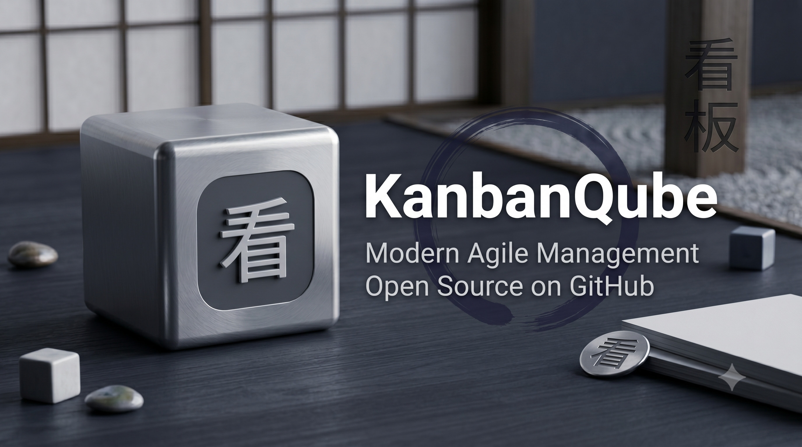
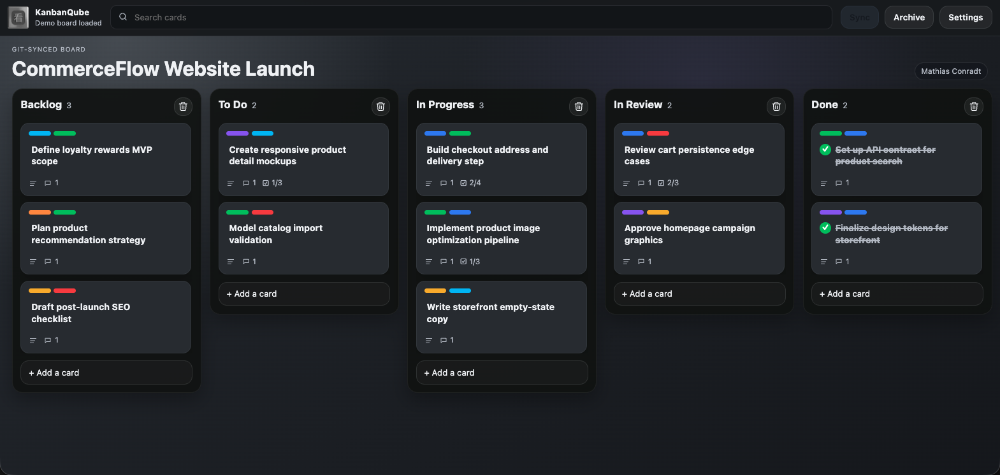

# KanbanQube

[](https://sonarcloud.io/summary/new_code?id=mathiasconradt_kanbanqube)
[](LICENSE)
[](https://ko-fi.com/mathiasconradt)




KanbanQube is a local-first desktop Kanban board app for solo users and tiny teams. It is designed for normal desktop browser use; there is no dedicated mobile version or mobile app.

A board lives as normal files in a regular vault folder on your machine and can optionally be placed inside a Git repository, so changes can be versioned and synced with tools you already use. The app intentionally does not provide a strong user-security or RBAC model; it assumes trusted local users or a very small trusted team.

See the [full feature list](#features) below. Uploaded files are stored in an `uploads/` folder, while board data is split into per-object JSON files under `board/` so Git can merge independent card and checklist edits more cleanly.



## Table Of Contents

- [Features](#features)
- [Requirements](#requirements)
- [Quick Start](#quick-start)
- [Run With npx](#run-with-npx)
- [Install With Homebrew](#install-with-homebrew)
- [Global npm Install](#global-npm-install)
- [Run On macOS Login](#run-on-macos-login)
- [Vaults](#vaults)
- [Board Workflow](#board-workflow)
- [Git Sync](#git-sync)
- [Trello Import](#trello-import)
- [Demo Board](#demo-board)
- [Identity](#identity)
- [Assignees And Due Dates](#assignees-and-due-dates)
- [Attachments And Covers](#attachments-and-covers)
- [Keyboard Shortcuts](#keyboard-shortcuts)
- [Development](#development)
- [Build](#build)
- [Release Automation](#release-automation)
- [Star History](#star-history)

## Features

- Local-first board vaults stored as normal files
- Configurable lanes and inline lane-title editing
- Optional lane background colors
- Collapsible lanes with drag-and-drop support into collapsed lanes
- Resizable lane width, applied consistently across lanes
- Cards with descriptions, comments, checklists, labels, due dates, and assignees
- Comment editing and deletion by the comment author
- Drag-and-drop card movement between lanes
- Board keyboard navigation and shortcuts
- Search across cards
- File attachments stored in the vault `uploads/` folder
- Image attachments as optional card covers
- Archive view with restore, delete, and delete-all actions
- Git sync for versioning and syncing vault changes
- User detection from Git config and Git commit authors
- Gravatar avatars with initials fallback
- Empty-board demo import
- Import from Trello board export (JSON) into an empty board
- Optional macOS LaunchAgent background startup
- Optional Electron desktop window via separate `kanbanqube-desktop` package

## Requirements

- Node.js 18 or newer
- Git, if you want repository sync
- A folder to use as your board vault

## Quick Start

Choose one mode:

| Mode | npx | Homebrew |
| --- | --- | --- |
| Lightweight browser/server | `npx kanbanqube` then open `http://localhost:3888` | `brew tap mathiasconradt/kanbanqube https://github.com/mathiasconradt/kanbanqube`, `brew install kanbanqube`, `kanbanqube`, then open `http://localhost:3888` |
| Desktop window | `npx kanbanqube-desktop` for quick testing only | Recommended: `brew tap mathiasconradt/kanbanqube https://github.com/mathiasconradt/kanbanqube`, `brew install --cask kanbanqube-desktop`, then open `KanbanQube.app` |

Both modes use the same default vault folder:

```text
macOS/Linux: ~/.kanbanqube
Windows: C:\Users\<you>\.kanbanqube
```

Pass a vault path only if you want to use a different folder:

```sh
npx kanbanqube /path/to/your/vault
npx kanbanqube-desktop /path/to/your/vault
kanbanqube /path/to/your/vault
```

## Run With npx

Lightweight browser/server mode:

```sh
npx kanbanqube
```

Then open:

```text
http://localhost:3888
```

Desktop window mode:

```sh
npx kanbanqube-desktop
```

Use this mainly for quick testing. On macOS, `npx kanbanqube-desktop` launches Electron directly, so pinning it to the Dock can pin Electron instead of KanbanQube. For normal desktop use, install the Homebrew cask.

By default, both commands use a `.kanbanqube` folder in the current user's home directory. This works across macOS, Linux, and Windows:

```text
macOS/Linux: ~/.kanbanqube
Windows: C:\Users\<you>\.kanbanqube
```

Pass a vault path only if you want to use a different folder:

```sh
npx kanbanqube /path/to/your/vault
```

You can choose a different port:

```sh
PORT=4000 npx kanbanqube
```

Custom port plus custom vault:

```sh
PORT=4000 npx kanbanqube /path/to/your/vault
```

The desktop package depends on the normal `kanbanqube` package and downloads Electron, so it is much larger than the lightweight browser/server package. Use `npx kanbanqube` if you prefer the smallest install.

## Install With Homebrew

Homebrew supports both modes from the same tap.

Lightweight browser/server mode:

```sh
brew tap mathiasconradt/kanbanqube https://github.com/mathiasconradt/kanbanqube
brew install kanbanqube
kanbanqube
```

Then open:

```text
http://localhost:3888
```

Custom vault:

```sh
kanbanqube /path/to/your/vault
```

Desktop window mode:

```sh
brew tap mathiasconradt/kanbanqube https://github.com/mathiasconradt/kanbanqube
brew install --cask kanbanqube-desktop
```

Then open `KanbanQube.app` from `/Applications` or Launchpad.

This is the recommended desktop installation on macOS because it installs a real `KanbanQube.app`. Dock pinning, app identity, reopen behavior, and the app icon work as expected.

The cask removes the macOS quarantine attribute during install. If you download the app release zip manually and macOS says the app is damaged, run:

```sh
xattr -cr "/Applications/KanbanQube.app"
```

## Global npm Install

Install the lightweight browser/server command globally:

```sh
npm install -g kanbanqube
kanbanqube
```

Install the desktop command globally:

```sh
npm install -g kanbanqube-desktop
kanbanqube-desktop
```

Local development install from this repository:

```sh
npm install
npm start
```

## Run On macOS Login

Use a macOS LaunchAgent if you want KanbanQube to start automatically in the background when you log in.

First check where `npx` is installed:

```sh
command -v npx
```

Create `~/Library/LaunchAgents/com.mathiasconradt.kanbanqube.plist`. This example omits a vault path, so KanbanQube uses the default `~/.kanbanqube` vault:

```xml
<?xml version="1.0" encoding="UTF-8"?>
<!DOCTYPE plist PUBLIC "-//Apple//DTD PLIST 1.0//EN"
  "http://www.apple.com/DTDs/PropertyList-1.0.dtd">
<plist version="1.0">
  <dict>
    <key>Label</key>
    <string>com.mathiasconradt.kanbanqube</string>

    <key>ProgramArguments</key>
    <array>
      <string>/opt/homebrew/bin/npx</string>
      <string>kanbanqube</string>
    </array>

    <key>EnvironmentVariables</key>
    <dict>
      <key>PATH</key>
      <string>/opt/homebrew/bin:/usr/local/bin:/usr/bin:/bin:/usr/sbin:/sbin</string>
      <key>PORT</key>
      <string>3888</string>
    </dict>

    <key>WorkingDirectory</key>
    <string>/Users/mathias.conradt</string>

    <key>RunAtLoad</key>
    <true/>

    <key>KeepAlive</key>
    <true/>

    <key>StandardOutPath</key>
    <string>/tmp/kanbanqube.out.log</string>

    <key>StandardErrorPath</key>
    <string>/tmp/kanbanqube.err.log</string>
  </dict>
</plist>
```

Load and start it:

```sh
launchctl bootstrap gui/$(id -u) ~/Library/LaunchAgents/com.mathiasconradt.kanbanqube.plist
launchctl kickstart -k gui/$(id -u)/com.mathiasconradt.kanbanqube
```

Check status and logs:

```sh
launchctl print gui/$(id -u)/com.mathiasconradt.kanbanqube
tail -f /tmp/kanbanqube.out.log
tail -f /tmp/kanbanqube.err.log
```

Stop and unload it:

```sh
launchctl bootout gui/$(id -u)/com.mathiasconradt.kanbanqube
```

The example runs KanbanQube on `http://localhost:3888`. If that port is already used, change the `PORT` value in the plist.

To use a custom vault path with LaunchAgent, add it as a third `ProgramArguments` string. Use an absolute path; `launchd` does not expand `~` there.

## Vaults

A vault is just a directory. KanbanQube stores:

```text
vault/
  board/
    meta.json
    cards/
    lists/
    checklists/
    actions/
    labels/
    members/
  uploads/
```

If `board/` does not exist, KanbanQube creates it automatically. If `uploads/` does not exist, it is created when the first file is uploaded.

Uploaded filenames are made unique while preserving the original name in the UI. For example:

```text
MyExample.png
MyExample.kbq_20260609T092141981Zb7a252.png
```

The stored filename prevents conflicts. The app still displays `MyExample.png`.

## Board Workflow

Use the board view for quick work:

- Click `+ Add a card` to create a card directly in the lane and type its title inline.
- Click the board title or lane title to rename it inline.
- Click a card to open its details.
- Settings can enable inline editing for existing card titles in board lanes.
- Set due dates and assignees in card details. Cards show due dates and assigned user avatars directly in the board view.

## Git Sync

Git sync is optional. If the vault is a Git repository with a configured `origin` remote, the Sync button is enabled.

When Sync runs, KanbanQube:

1. Saves pending board changes.
2. Checks whether anything in the vault repository changed.
3. Stages and commits all repository changes when needed, including `board/`, `uploads/`, and newly added files.
4. Runs `git pull --rebase` to bring in remote changes after local work is committed.
5. Pushes to the configured remote.
6. Reloads the board from disk so changes pulled from another machine are visible without refreshing the browser.

If the vault is not a Git repository, or no remote is configured, Sync stays disabled. You can still use the board locally.

Settings includes `Run Git sync in the background (no dialog)`. When enabled, the Sync button runs without opening the sync log automatically. The status text under the app title can still be clicked to open the sync log during or after sync.

Recommended setup:

```sh
mkdir my-kanban-vault
cd my-kanban-vault
git init
git remote add origin git@github.com:you/my-kanban-vault.git
npx kanbanqube .
```

Commit and push once if your remote requires an initial branch:

```sh
git add board
git commit -m "Initialize KanbanQube board"
git push -u origin main
```

## Trello Import

KanbanQube can import a Trello board export JSON from Settings. Import is only enabled when the current board has no cards. This keeps accidental replacement of an active board from happening inside the app.

Imported data is normalized and written into the split `board/` vault layout.

## Demo Board

The repository includes `demo_board.json`, a sample e-commerce product board with design, UX, frontend, backend, QA, content, and analytics work spread across the default lanes.

When a vault has no cards, KanbanQube asks whether to load the demo board. If accepted, the app loads `demo_board.json` and saves it into the current vault using the same path as a normal import.

## Identity

KanbanQube reads your Git identity from the vault repository first:

```sh
git config --local user.name
git config --local user.email
```

If local values are missing, it falls back to global Git config:

```sh
git config --global user.name
git config --global user.email
```

If no Git name is configured, KanbanQube falls back to the current system username returned by `whoami`. Email is optional; if no email is configured, the app still uses the detected name.

That name is used for comments and activity entries. The settings dialog shows the detected name and email as read-only values.

KanbanQube also reads commit authors from the vault Git repository and makes them available as assignable users. Git can usually provide the author name and email address from existing commits. If the vault has no Git history, KanbanQube still includes your own detected identity.

User avatars are loaded from Gravatar based on email address. If no Gravatar image exists, the app falls back to initials.

## Assignees And Due Dates

Open a card to assign users and set a due date. Assigned users are shown as small avatars on the card in board view, with their name available on hover.

Due dates are stored on the card and shown below the card title in board view. Completed cards keep the due date visible in a completed state, while overdue open cards are highlighted.

## Attachments And Covers

Drop files onto a card or into the card details view to attach them. Files are uploaded into the vault `uploads/` folder.

Images can be used as card covers. The cover is stored as a pointer to the attachment in `card.cover.idAttachment`, so removing a cover does not delete the attachment. You can also select another image attachment as the cover.

Deleting an uploaded attachment from a card also deletes the physical file from `uploads/` when no other card still references that file.

## Keyboard Shortcuts

Board view shortcuts are ignored while typing in inputs or while a dialog is open.

| Key | Action |
| --- | --- |
| Arrow keys | Select cards across lanes and rows |
| Enter | Open selected card details |
| Space | Toggle selected card done status |
| c | Archive selected card |
| m | Assign or unassign current user on selected card |
| 1-9 | Toggle the matching label by label-list order |

## Development

Install repository dependencies:

```sh
npm install
```

Start the lightweight browser/server app from the repository with the default `~/.kanbanqube` vault:

```sh
npm start
```

Or pass a custom vault path:

```sh
npm start -- /path/to/your/vault
```

Run checks:

```sh
npm test
```

Run the desktop wrapper during local development:

```sh
npm install --prefix desktop
npm run desktop
```

Run desktop checks:

```sh
npm test --prefix desktop
```

Package the desktop app locally on macOS:

```sh
npm run package:mac --prefix desktop
```

Main files:

- `server.js` - HTTP server, vault storage, upload handling, Git sync
- `desktop/main.js` - Electron desktop wrapper
- `desktop/package.json` - separate `kanbanqube-desktop` npm package
- `Casks/kanbanqube-desktop.rb` - Homebrew cask for the packaged macOS app
- `public/app.js` - board UI behavior
- `public/styles.css` - app styling
- `public/index.html` - static app shell

## Build

KanbanQube has no frontend build step. The lightweight app is plain Node.js plus static browser assets. The desktop package is an Electron wrapper that starts the same local server and opens it in a desktop window.

Validate the lightweight browser/server package:

```sh
npm test
```

Validate the desktop package:

```sh
npm test --prefix desktop
```

Dry-run package contents:

```sh
npm pack --dry-run
npm pack --dry-run ./desktop
```

Package managers can install the lightweight app because root `package.json` exposes the `kanbanqube` executable through the `bin` field. The desktop package has its own `desktop/package.json` and exposes the `kanbanqube-desktop` executable.

The Homebrew cask build packages the Electron app for both Apple Silicon and Intel macOS:

```sh
npm run package:mac --prefix desktop
```

## Release Automation

KanbanQube is prepared for npm and Homebrew releases. The release publishes two npm packages and two Homebrew install options:

- `kanbanqube` - lightweight browser/server command
- `kanbanqube-desktop` - optional Electron desktop command
- `Formula/kanbanqube.rb` - Homebrew formula for the lightweight command
- `Casks/kanbanqube-desktop.rb` - Homebrew cask for the packaged macOS app

Required GitHub secrets:

- `NPM_TOKEN` - npm automation token for publishing `kanbanqube` and `kanbanqube-desktop`

Release flow:

1. A non-bot push to `main` runs the version bump workflow.
2. The workflow bumps the patch version in `package.json` and `package-lock.json`.
3. It updates `desktop/package.json`, keeps `kanbanqube-desktop` pinned to the same `kanbanqube` version, updates the Homebrew formula and cask versions, and pushes a matching `vX.Y.Z` tag.
4. The release workflow runs for that tag.
5. It runs root checks and desktop checks.
6. It publishes `kanbanqube` to npm.
7. It publishes `kanbanqube-desktop` to npm.
8. It creates the GitHub release asset from the lightweight package tarball.
9. It builds macOS desktop app zips for Apple Silicon and Intel.
10. It uploads those zips to the GitHub release.
11. It updates the Homebrew formula SHA on `main`.

After release, users can run:

```sh
npx kanbanqube
npx kanbanqube-desktop
brew tap mathiasconradt/kanbanqube https://github.com/mathiasconradt/kanbanqube
brew install kanbanqube
brew install --cask kanbanqube-desktop
```

## Star History

[](https://www.star-history.com/?repos=mathiasconradt%2Fkanbanqube&type=timeline&logscale=&legend=top-left)
